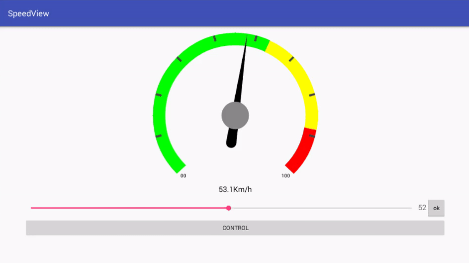
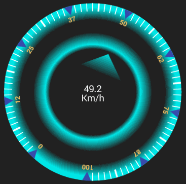
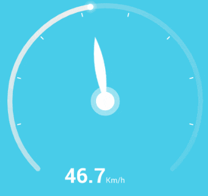
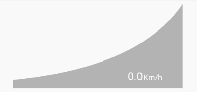

# SpeedView
Dynamic Speedometer, Gauge for Android. **amazing**, **powerful**, and _multi shape_ :zap: , you can change (colors, bar width, shape, text, font ...everything !!), this Library has also made to build **games** with `accelerate` and `decelerate`,
 [see project on GitHub](https://github.com/anastr/SpeedView/).

`minSdkVersion=8`

Library Size just ~ 51 KB.

[](https://android-arsenal.com/details/1/4169)
[](#)
[](https://bintray.com/anastr/maven/SpeedView)


**Speedometers...**<br/>




**Gauges...**<br/>



# Download

**add this line to** `build.gradle`

```gradle

dependencies {
	implementation 'com.github.anastr:speedviewlib:1.3.0'
}

```

for **maven**

```maven
<dependency>
  <groupId>com.github.anastr</groupId>
  <artifactId>speedviewlib</artifactId>
  <version>1.3.0</version>
  <type>pom</type>
</dependency>
```
**[Get Starting](https://github.com/anastr/SpeedView/wiki/0.-Get-Started)** with _SpeedView Library_.
# Simple Usage
choose one of Speedometers, gauges and add it to your `Layout.xml`, here we use **SpeedView**.<br>
```xml

<com.github.anastr.speedviewlib.SpeedView
        android:id="@+id/speedView"
        android:layout_width="wrap_content"
        android:layout_height="wrap_content" />

```

for all speedometers and gauges, this simple method to smoothly change speed:
```java
SpeedView speedometer = findViewById(R.id.speedView);

// move to 50 Km/s
speedometer.speedTo(50);
```

by default, the speed change Duration between last speed and new speed is `2000 ms`.<br>
you can use other Duration by method :
```java
// move to 50 Km/s with Duration = 4 sec
speedometer.speedTo(50, 4000);
```

automatically indicator move around current speed to add some reality to speedometer because of [Tremble](https://github.com/anastr/SpeedView/wiki/0.-Get-Started#tremble), you can stop it by `app:sv_withTremble="false"` Attribute or call `speedometer.setWithTremble(false);` method in the code.

**for more control**, see The most important methods at [Get Started - Wiki](https://github.com/anastr/SpeedView/wiki/0.-Get-Started) for **All Speedometers & Gauges**.<br>
and also you can see **Advanced Usage** in [Usage - Wiki](https://github.com/anastr/SpeedView/wiki/Usage) and [Work With Notes - Wiki](https://github.com/anastr/SpeedView/wiki/Notes).<br>


## All Speedometers, Gauges :

<table style="width:100%">
  <tr>
    <th>Name</th>
    <th>Screenshot</th>
    <th>XML Layout</th>
  </tr>

  <tr>
    <td width="24%"> <a href="https://github.com/anastr/SpeedView/wiki/1.-SpeedView">1. SpeedView - Wiki</a></td>
    <td width="22%"></td>
    <td>
       <pre>
&lt; com.github.anastr.speedviewlib.SpeedView
        android:id="@+id/speedView"
        android:layout_width="wrap_content"
        android:layout_height="wrap_content" />
	</pre>
    </td>
  </tr>

  <tr>
    <td> <a href="https://github.com/anastr/SpeedView/wiki/2.-DeluxeSpeedView">2. DeluxeSpeedView - Wiki</a></td>
    <td></td>
    <td>
      <pre>
&lt; com.github.anastr.speedviewlib.DeluxeSpeedView
        android:id="@+id/deluxeSpeedView"
        android:layout_width="wrap_content"
        android:layout_height="wrap_content" />
      </pre>
    </td>
  </tr>

  <tr>
    <td> <a href="https://github.com/anastr/SpeedView/wiki/3.-AwesomeSpeedometer">3. AwesomeSpeedometer - Wiki</a></td>
    <td></td>
    <td>
      <pre>
&lt; com.github.anastr.speedviewlib.AwesomeSpeedometer
        android:id="@+id/awesomeSpeedometer"
        android:layout_width="wrap_content"
        android:layout_height="wrap_content" />
      </pre>
    </td>
  </tr>

  <tr>
    <td> <a href="https://github.com/anastr/SpeedView/wiki/4.-RaySpeedometer">4. RaySpeedometer - Wiki</a></td>
    <td></td>
    <td>
      <pre>
&lt; com.github.anastr.speedviewlib.RaySpeedometer
        android:id="@+id/raySpeedometer"
        android:layout_width="wrap_content"
        android:layout_height="wrap_content" />
      </pre>
    </td>
  </tr>

  <tr>
    <td> <a href="https://github.com/anastr/SpeedView/wiki/5.-PointerSpeedometer">5. PointerSpeedometer - Wiki</a></td>
    <td></td>
    <td>
      <pre>
&lt; com.github.anastr.speedviewlib.PointerSpeedometer
        android:id="@+id/pointerSpeedometer"
        android:layout_width="wrap_content"
        android:layout_height="wrap_content" />
      </pre>
    </td>
  </tr>

  <tr>
    <td> <a href="https://github.com/anastr/SpeedView/wiki/6.-TubeSpeedometer">6. TubeSpeedometer - Wiki</a></td>
    <td></td>
    <td>
      <pre>
&lt; com.github.anastr.speedviewlib.TubeSpeedometer
        android:id="@+id/tubeSpeedometer"
        android:layout_width="wrap_content"
        android:layout_height="wrap_content" />
      </pre>
    </td>
  </tr>

  <tr>
    <td> <a href="https://github.com/anastr/SpeedView/wiki/7.-ImageSpeedometer">7. ImageSpeedometer - Wiki</a></td>
    <td></td>
    <td>
      <pre>
&lt; com.github.anastr.speedviewlib.ImageSpeedometer
        android:id="@+id/imageSpeedometer"
        android:layout_width="wrap_content"
        android:layout_height="wrap_content"
        app:sv_image="@drawable/your_image" />
      </pre>
    </td>
  </tr>

  <tr>
    <td> <a href="https://github.com/anastr/SpeedView/wiki/8.-ProgressiveGauge">8. ProgressiveGauge - Wiki</a></td>
    <td></td>
    <td>
      <pre>
&lt; com.github.anastr.speedviewlib.ProgressiveGauge
        android:id="@+id/gauge"
        android:layout_width="300dp"
        android:layout_height="wrap_content" />
      </pre>
    </td>
  </tr>

  <tr>
    <td> <a href="https://github.com/anastr/SpeedView/wiki/9.-ImageLinearGauge">9. ImageLinearGauge - Wiki</a></td>
    <td></td>
    <td>
      <pre>
&lt; com.github.anastr.speedviewlib.ImageLinearGauge
        android:id="@+id/gauge"
        android:layout_width="wrap_content"
        android:layout_height="wrap_content"
        app:sv_image="@drawable/fire" />
      </pre>
    </td>
  </tr>
</table>

## TODO
* build start animation.
* add fuel gauge component.
* build new custom speedometer.

your `pull request` is always Welcome, please review the **[rules of contribution](https://github.com/anastr/SpeedView/blob/master/CONTRIBUTING.md)** to make useful change.

## Coming Soon ...
I will try to draw this Speedometer.
if you have any idea, image, template please **open new issue** and give me the image , and i well try to add it to the Library.

 

# LICENSE
```

Copyright 2016 Anas Altair

Licensed under the Apache License, Version 2.0 (the "License");
you may not use this file except in compliance with the License.
You may obtain a copy of the License at

    http://www.apache.org/licenses/LICENSE-2.0

Unless required by applicable law or agreed to in writing, software
distributed under the License is distributed on an "AS IS" BASIS,
WITHOUT WARRANTIES OR CONDITIONS OF ANY KIND, either express or implied.
See the License for the specific language governing permissions and
limitations under the License.

```
